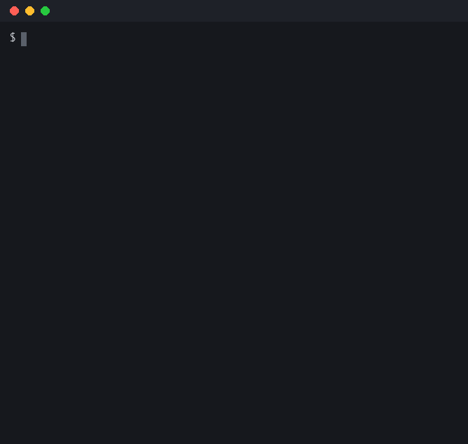

# Venos

[](https://github.com/Vpdrla/Venos/actions/workflows/ci.yml)
[](LICENSE)

*English | [한국어](README.ko.md)*

**▶ [Try it in your browser — no install needed](https://vpdrla.github.io/Venos/)**



A pseudocode-style programming language designed to be readable by non-programmers.
Implemented in a single C++ file (~3,400 lines) with a **dual backend: a tree-walking interpreter and a C++ transpiler** that produces standalone native executables.

```
func fib(n) {
    if n <= 2 then { return 1 }
    return fib(n - 1) + fib(n - 2)
}

for i = 1 to 10 {
    print "fib({i}) = {fib(i)}"    # string interpolation
}

try {
    let n = num(input "Enter a number: ")
    print "10 /", n, "=", 10 / n
} catch err {
    print "Something went wrong:", err
}
```

Identifiers can be written in any language (full UTF-8 support), so classes, functions,
and variables work naturally in Korean, English, or anything else:

```
class 사람 {
    func init(이름) { self.이름 = 이름 }
    func 인사() { print "안녕, 나는 " + self.이름 }
}
사람("미르").인사()
```

## Features

- **Readable syntax** — `if x > 5 then { }`, `for i = 1 to 10`, `while x > 0 do { }`; optional filler keywords (`then`, `do`) make code read like pseudocode
- **Two ways to run** — an interpreter for instant feedback, and a transpiler (`.my` → C++ → native executable via g++). Both backends are differential-tested to produce identical output for the same program
- **A complete language** — functions (recursion, hoisting), classes (constructors, methods, `self`), lists and dictionaries (reference semantics, deep equality with `==`, `+` to join lists, `copy()` for deep copies), string interpolation (`"name: {x}"`), UTF-8-aware string handling, `try/catch`, `import`, file I/O, and 30+ built-in functions
- **Helpful errors** — error messages with line numbers; with `import`, errors point to the original file (`[utils.my line 3]`). Undefined variables and wrong argument counts are caught at build time
- **Built-in dev environment** — a CLI shell with file management, an editor (arrow-key scroll viewer, paste mode), and one-command run/build

> Note: error messages and shell UI are currently in Korean.

## Playground

The [web playground](https://vpdrla.github.io/Venos/) runs the full interpreter in your browser via WebAssembly —
including classes, try/catch, and even the example RPG (input pops up as a dialog; `import` is desktop-only,
and file I/O writes to in-memory storage that resets on page reload).

It is built to be usable in a classroom where nothing can be installed:

- **🔗 Share** turns your program into a link, so a teacher can hand out a starting point and a student can hand back a result
- **Your work is saved automatically** — closing the tab does not lose it
- **📚 Lessons** walks a beginner through the language step by step, and every lesson has its own link (`#lesson=lists`)

## Learning Venos

**[TUTORIAL.md](TUTORIAL.md)** — 12 lessons from `print` to a small guessing game, each one runnable in the
playground with a single click. Korean version: [TUTORIAL.ko.md](TUTORIAL.ko.md).

## Install

Grab a binary from the [latest release](https://github.com/Vpdrla/Venos/releases/latest) — it is
statically linked, so there is nothing else to install.

| Your machine | File |
|---|---|
| Windows | `venos-windows-x64.exe` |
| macOS (Intel or Apple Silicon) | `venos-macos-universal` |
| Linux | `venos-linux-x64` |

On macOS and Linux, make it executable first: `chmod +x venos-linux-x64`.

### Build from source instead

```bash
g++ -std=c++17 -O2 -o venos venos.cpp        # Linux / macOS / WSL
g++ -std=c++17 -O2 -o venos.exe venos.cpp    # Windows (MinGW)
```

No dependencies. Requires C++17 (C++20 compatible), and builds clean with GCC, Clang and MinGW.

## Usage

```bash
./venos                      # interactive shell (create / code / run / build ...)
./venos program.my           # run a file directly (interpreter)
./venos build program.my     # compile to a native executable (needs g++ installed)
./venos build program.my run # compile and run immediately
```

The interpreter is self-contained; only `build` shells out to `g++`.

Inside the shell, `repl` starts a line-by-line REPL (type an expression to see its value).

The full language reference: **[VENOS_SPEC.en.md](VENOS_SPEC.en.md)** (English) / **[VENOS_SPEC.md](VENOS_SPEC.md)** (한국어).
The spec is written so you can hand it to an AI assistant and have it write valid Venos code (designed with AI-assisted "vibe coding" in mind).

## Editor support

`vscode-venos/` contains a VS Code extension with syntax highlighting for `.my` files —
copy the folder into `~/.vscode/extensions/` (see its README).

## Example

A text RPG exercising classes, dictionaries, string interpolation, and save/load via file I/O — in two flavors:
`examples/rpg.en.my` (English identifiers, the one in the demo above) and `examples/rpg.my` (the same game written entirely with Korean identifiers):

```bash
venos examples/rpg.en.my
venos examples/rpg.my
```

## Architecture

```
source → lexer (tokens) → recursive-descent parser (AST) ─┬→ tree-walking interpreter
                                                          └→ C++ code generation → g++ → native executable
```

Everything — lexer, parser, AST, interpreter, transpiler, runtime library, and the CLI shell — lives in the single file `venos.cpp`.

## Why

I built this from scratch to understand how programming languages actually work.
It started as v0.1 (an interpreter that could only do variables and `print`) and grew to v1.6
by writing real programs in it, finding what was missing, and adding it — the text RPG in
`examples/` was the validation project that drove features like `exists()`, `try/catch`, and `import`.

## Testing

Every language feature is verified by **differential testing**: each program in `tests/cases/`
runs on both backends (the interpreter and the transpiled native binary) and the outputs must match.
CI does this on every push:

```bash
tests/run_tests.sh
```

## License

[MIT](LICENSE)
